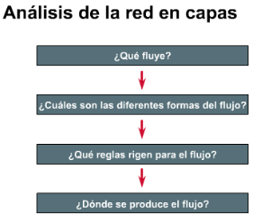
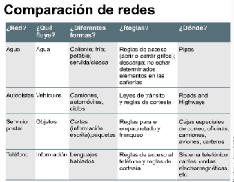
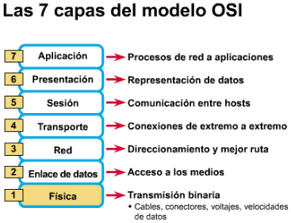
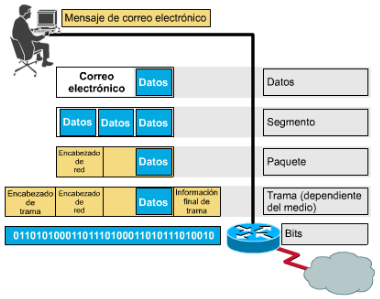
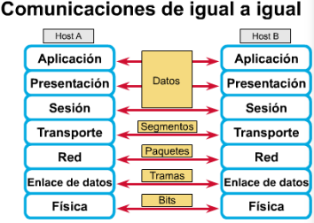
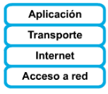
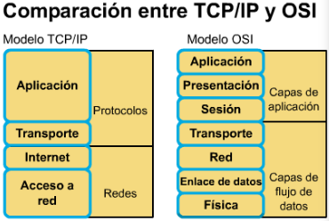
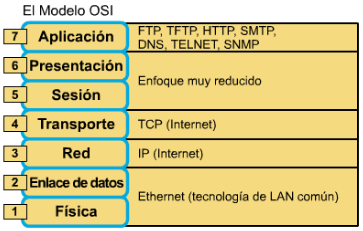

# El modelo OSI
Al inicio muchas de las implementaciones de hardware y software eran 
diferentes entre sí, lo que probocó la incompativilidad entre las mismas. Para
solcionar este problema, la **Organización Internacional para la Normalización
 (ISO)** en **1984** elaboró el modelo de referencia **OSI** que permitía
 implementar redes que pudieran comunicarse y trabajar en conjunto 
 **(Interoperabilidad)**.

## Modelo general de comunicación
**Uso de las capas para analizar problemas en un flujo de materiales**

El empleo de capas permite perfeccionar el recibimiento y envío de información
ya que cada una de estas tienen un objetivo específico. La siguientes imagenes
ilustran como un análisi en capas nos permite reconocer los componentes que
intervienen en un diferente proceso.

{ width=35% }\
{ width=45% }\

## Origen, Destino y paquetes de datos
La información que viaja a través de una red se conoce como *paquete*, *datos*
o como *paquete de datos*. Un **paquete de datos** es una *unidad de 
información* lógicamente agrupada.

## Medios
Un medio es el material a través del cual viajan los paquetes de datos. Puede
ser:
* Cables telefónicos
* UTP de categoría 5 (Ethernet 10BASE-T)
* cable coaxial (TV por cable)
* Fibra óptica
Otros medios menos evidentes son la atmosfera que transporta ondas de radio,
microondas y luz.

## Protocolo

Es un conjunto de **reglas** que hacen que la comunicación en una red sea más
eficiente. Su defiición técnica sería: Conjunto de **normas**, o un acuerdo, que
determina el formato y la transmisión de datos. La capa *n* de un computador
se comunica con la capa *n* del otro. Las normas y convenciones que se utilizan
en esta comunicación se denominan colectivamente *protocolo de la capa n*.

## Evolución de las normas de networking de ISO

A principios de los *80's* se produjo un enorme crecimiento en la cantidad y
tamaño de las redes, sin embargo las LAN, MAN, WAN eran caóticas. Las empresas
se dieron cuenta de que necesitaban salir de los sistemas networking 
*propietarios*.

**ISO** estudió esquemas de red como DECENT, SNA y TCP/IP a fin de encontrar un 
conjunto de reglas. Se logró dividir las comunicaciones complejas en tareas más
pequeñas y separadas. Su modelo proporcionó a los fabricantes un conjunto de
estándares que aseguraron una mayor *compativilidad* e *interoperabilidad* entre
los distintos tipos de tecnología de red utilizados por las empresas a nivel
mundial.

## Propósito del modelo de referencia OSI

Permite que los usuarios vean las funciones de red que se producen en cada capa
y comprender como viaja la información a través de la red.

En el modelo OSI, hay **7 capas** numeradas, donde cada una cumle una función
específica. Las ventajas de la división en capas son:
* Divide la comunicación de red en partes más pequeñas y sencillas.
* Normaliza los componentes de red para permitir el desarrollo y el soporte de
los productos de diferentes fabricantes.
* Permite a los distintos tipos de hardware y software de red comunicarse entre
sí.
* Impide que los cambios de una capa afecten a las demás.
* Facilita el aprendizaje de su funcionamiento.

## Funciones de cada capa

El problema de trasladar información entre computadores se divide en 7 problemas
más pequeños y de tratamiento más simple en el modelo de referencia. Cada
problema está representado por su propia capa en el modelo.

{ width=40% }\

### Capa 7: La capa de aplicación

Es la capa más cercana al usuario, suministra servicios de red a las 
aplicaciones de ususario. A diferencia de las demás capas no proporciona 
servicios a ninguna otra capa. **Navegadores web**

### Capa 6: La capa de presentación

Garantiza que la información que envía la capa de _aplicación_ pueda ser leída 
por la capa de aplicación de otro. De ser necesario, esta **traduce** varios 
formatos de datos utilizando un _formato común_. **Formato de datos común**

### Capa 5: La capa de sesión

Establece, administra y finaliza las sesiones entre los **host** que se están
comunicando. Proporciona sus servicios a la capa de _presentación_. Sincroniza
el diálogo entre las capas de presentación de los 2 host y **admininistra su
intercambio de datos**, clase de servicio y un registro de **excepciones** 
acerca de los problems de la capa de _sesión, presentación y aplicación_.
**Conversaciones**.

### Capa 4: La capa de transporte

Segmenta los datos originados en el host emisor y los reensambra en el receptor.
Suministra un servicio de transporte que aísla a las capas superiores de sus
detalles de implementación. Establece, mantiene y termina adecuadamente los
circuitos virtuales. Se utilizan dispositivos de detección y recuperación de
errores de transporte. **Calidad de servicio y confiabilidad**.

Mientras que las capas de _aplicación, presentación y sesión_ estan relacionadas
con asuntos de **aplicaciones**, las 4 capas inferiores se encargan del 
**transporte** de datos.

### Capa 3: La capa de red

Proporciona **conectividad** y **selección de ruta** entre dos host. **ruta, 
direccionamiento y enrutamiento**.

### Capa 2: La capa de enlace de datos

Proporciona **tránsito** de datos _confiable_ a través de un enlace físico. Se
ocupa del direccionamiento físico, la topología de red, notificaciones de 
errores, entrega ordenada de tramas y control de flujo. **Control de acceso al
medio**.

### Capa 1: La capa física

Define las **especificaciones** eléctricas, mecánicas, de procedimieto y 
funcionales para activar, mantener y desactivar el enlace físico entre sistemas
finales. Las características como niveles de voltaje, temporizacion de cambios 
de voltaje, velocidad de datos físicos, distancias de transmisión máximas entre
otros son especificaciones de esta capa. **Señales y medio**.

## Encapsulamiento

Los datos deben empaquetarce ea través de un proceso denominado encapsulamiento.
El encapsulamiento **rodea los datos con la información de protocolo necesaria**
antes que se una al tránsito de la red. A medida que los datos se desplazan a
través de las capas del modelo OSI, reciben encabezados.

**Ejemplo**

{ width=40% }\

1. **Crear los datos**.
1. **Empaquetar los datos para ser transportado de extremo a extremo:** Se 
asegura que los host se comunique de manera confiable.
1. **Anexar la dirección de red al encabezado:** Direcciones de origen y 
destino.
1. **Anexar la dirección local al encabezado de enlace de datos:** Permite
conectarce al proximo dispositivo de red conectado al enlace.
1. **Realizar la conversión a bits para su transmisión**

## Nombres de los datos en cada capa del modelo OSI

Cada capa debe comunicarce con su igual en el host de destino, esta comunicación
se conoce como _comunicación de par-apar-_. En ese proceso cada protocolo de 
capa intercambia información que se conoce como **unidades de datos de protocolo
(PDU)** entre capas iguales.

Cada capa depende de la capa OSI que se encuentra bajo ella, la capa inferior
utiliza el encapsulamiento para colocar la PDU de la **capa superior** en
su campo de datos, luego le puede agregar cualquier encabezado e información
final que la capa necesite para ejecutar su función.

{ width=40% }\

## Comportamiento del modelo OSI y el modelo TCP/IP

### El modelo de referencia TCP/IP

El estándar abierto de Internet desde el punto de vista histórico y técnico es
el _Protocolo de Transmisión/Protocolo de Internet (TCP/IP)_. El modelo de
referencia TCP/IP y la pila de protocolo TCP/IP hacen que sea posible la
comunicación entre dos computadores desde cualquier parte del mundo a casi la
velocidad de la luz.

### Las capas del modelo de referencia TCP/IP

El **Departamento de Defensa de EE.UU. (DoD)** creó el modelo TCP/IP porque
necesitaba una red que puediera sobrevivir ante cualquier circunstacia, incluso
una guerra nuclear.

{ width=20% }\

#### Capa de aplicación

Los diseñadores pensaron que la capa de aplicación debería incluir los detalles
de la capa de sesión y aplicación. Esta capa maneja **datos de alto nivel**,
aspectos de representación, codificación y control de dialogo.

#### Capa de transporte

Se refiere a aspectos de **calidad de servicio** con respecto a la 
confiabilidad, el control de flujo y la corrección de errores. El protocolo TCP,
ofrece maneras flexibles y de alta calidad para crear comunicaciones confiables,
sin problemas de flujo y con un nivel de error bajo. TCP es un protocolo 
orientado a conexión. Mantiene un diálogo entre origen y el destino mientras
empaqueta la información en la capa de aplicación en segmentos.

#### Capa de internet

Su propósito en enviar paquetes desde cualquier red en la internetwork y que
estos paquetes lleguen a su destino independientemente de la ruta y de las redes
que recorrieron para llegar allí. El protocolo que rige esta capa es el IP. En
esta capa se determina la mejor ruta y comunicación de paquetes.

#### Capa de acceso a la red

También se denomina **capa de host a la red**. Se ocupa de todos los aspectos
que requiere un paquete IP para realizar realmente un enlace físico. Esta capa
incluye los detalles de tecnología LAN y WAN y todos los detalles de las 
**capas física y de enlace de datos** del modelo OSI.

## Comparación entre el modelo OSI y el modelo TCP/IP

{ width=40% }\

### Similitudes

* Se dividen en capas
* Tienen capas de aplicación (pero con servicios muy distintos).
* Tienen capa de transporte y de red similares.
* La tecnología es de conmutación por paquetes (no de conmutación por circuito)
* Los profesionales de networking deben conocer ambos.

### Diferencias

* TCP/IP combina las funciones de la capa de presentación y de sesión en la de
aplicación.
* TCP/IP combina las capas de enlace de datos y la física del modelo OSI en una
sola capa.
* TCP/IP parece ser más simple porque tiene menos capas.
* Los protocolos TCP/IP son estándares en torno a los cuales se desarrolló la
Internet, de modo que la credibilidad del modelo TCP/IP se debe en gran parte
a sus protocolos. 
* En comparación, las redes típicas **no** se desarrollan normalmente a partir
del protocolo OSI, aunque este se usa como **guía**.

## Uso de los modelos OSI y TCP/IP

Aunque los protocolos TCP/IP representan los estándares en base a los cuales
se ha desarrollado internet, el modelo OSI es importante porque:
* Es un estándar mundial, genérico, independiente de los protocolos.
* Es más detallado, lo que hace que sea más útil para enseñanza y aprendizaje.
* Al ser más detallado, resulta más útil para el diagnóstico de fallas.

El TCP es el protocolo de la **capa 4** del OSI, el IP el protocolo de la **capa
3** y Ethernet como una **tecnología** de las **capas 2 y 1**.

{ width=40% }\
