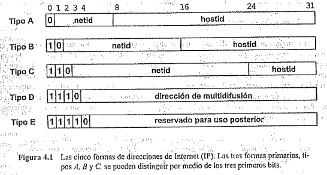

# Resumen Libro Douglas interentworking with TCP/IP

## Modelo TCP/IP [red de redes]

## Datagrama IP
 
## ICMP

El Protocolo de Mensajes de Control de intemet proporciona una comunicación extranornal 
entre ruteadores y anfitriones; es una parte integral y obligatoria del IP. El ICMP incluye mensajes de *disminución de tasa* al origen que retardan la velocidad de transmisión, mensajes de *redireccionamiento* que pueden utilizar los anfitriones cambiar su mesa de enrutado, y mensajes de *"echo request/reply"* que los anfitriones para determinar si Se puede accesar un destiño, Un mensaje ICMP viaja en el área de datos de un datagrama IP y tiene tres campos de longitud fija al comienzo del mensaje : el campo type , un campo code y el campo ICMP checksum (suma de verificación). El tipo de mensaje determina el formato del :resto del mensaje, así como su significado.

## Encaminamiento RIPv2

## Direccionamiento

Cada host conectado a la red de redes tiene asigando un *identificador universal* de 32 bits como su direccion dentro de la red.
Los bits de una dirección IP de todos los host en una misma red comparten un prefijo común.

Definida una dirección IP, se puede determinar su tipo según los tres bits de orden, de los que son necesarios  solo dos bits para distinguir entre los tres tipos primarios.
* Tipo A:  2^16 hosts; 7 bits net, 24 bits host (1-126)
* Tipo B: 14 bits net, 16 bits host (128-191)
* Tipo C: 21 bits net, 8 bits host (192-223)
* tipo D (224-239) 
* Tipo E (240-255)

La mayor desventaja del esquema de direccionamiento IP es que si una máquina tiene muchas direcciones, saber una dirección no será suficiente para alcanzarla cuando no exista un camino, hacia la interfaz especificada (por ejemplo, si una red en particular no está disponible). 
Para permitir el intercambio de datos binarios entre los protocolos TCP/IP se requiere del ordenamiento estándar de octetos para los enteros dentro de los campos del protocolo. Un anfitrión debe convertir todos los dalos binarios de su. forma, interna a un orden estándar de Octetos de red antes de enviar un paquete y debe hacer conversión de orden de octeto de red al orden 
temo cuando reciba paquetes. 

